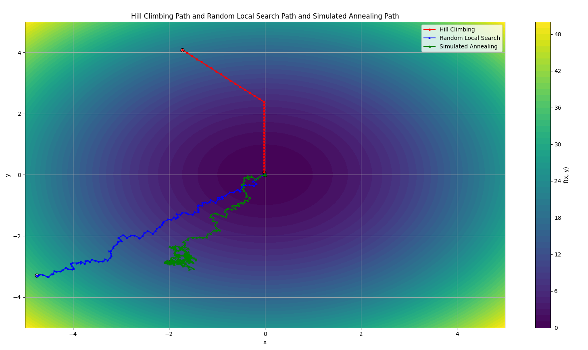

# goit-algo2-hw-09


Program to find the minimum of the sphere function using Hill Climbing, Random Local Search and Simulated Annealing algorithms.

Output:

```
Hill Climbing:
Розв'язок: [-0.02116498 -0.01723844] Значення: 0.0007451201

Random Local Search:
Розв'язок: [-0.00195295 -0.00217854] Значення: 0.0000085601

Simulated Annealing:
Розв'язок: [-0.00419723 -0.00561144] Значення: 0.0000491050
```

Visualization:


Conclusions:

Алгоритм **Random Local Search** повернув найкращий приближений результат мінімуму фнункції

Алгоритм **Simulated Annealing** знайшов приблизний мінімум, але він використовує більше ітерацій, і на початових етапх, при великих температурних значеннях намагається знайти кращий результат, проте на даному прикладі, це фактично просто додаткові операції, але в інших функціях це може внести вагомий результат


Алгоритм **Hill Climbing** виконуєєть майже лінійно, і показує дость не поганий резульата, проте знайшовши локальний мінімум, він не може знайти глобальний, чи більш кращий результат, в проівнянні з **Random Local Search**.